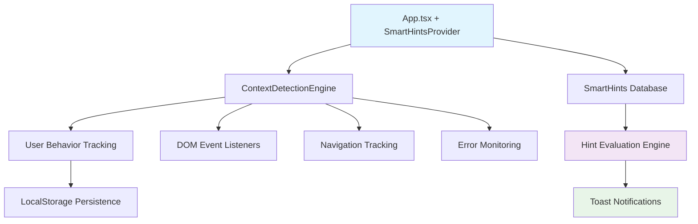

# 📚 MANUAL TÉCNICO - Sistema Smart Hints SISGEAD 2.0

**Versão:** 2.0.0  
**Data:** 04 de novembro de 2025  
**Autor:** GitHub Copilot & Team SISGEAD

---

## 🎯 **VISÃO GERAL**

O **Sistema Smart Hints** é uma solução inovadora de UX autoexplicativo que substitui tooltips estáticos por orientação contextual inteligente baseada no comportamento real do usuário.

### **Características Principais:**
- 🧠 **Inteligência Comportamental:** Aprende padrões do usuário
- 🎯 **Contextual:** Dicas aparecem no momento certo
- 📱 **Responsivo:** Adapta-se a diferentes dispositivos  
- ⚡ **Performance:** Singleton pattern + lazy loading
- 🔧 **Extensível:** Fácil adição de novos hints

---

## 🏗️ **ARQUITETURA DO SISTEMA**



### **Componentes Core:**

| Componente | Responsabilidade | Tamanho |
|------------|------------------|---------|
| `SmartHints.tsx` | UI + Lógica de exibição | 8.8KB |
| `SmartHintsProvider.tsx` | Orquestração React Context | 4.3KB |
| `ContextDetection.ts` | Engine comportamental | 9.3KB |  
| `smartHintsDatabase.ts` | Base de conhecimento | 11.6KB |

---

## 🔧 **GUIA DE IMPLEMENTAÇÃO**

### **1. Configuração Inicial**

```tsx
// App.tsx - Envolvimento da aplicação
import { SmartHintsProvider } from './components/SmartHintsProvider';

export default function App() {
  return (
    <SmartHintsProvider>
      {/* Sua aplicação aqui */}
    </SmartHintsProvider>
  );
}
```

### **2. Adicionando Data-Actions**

```tsx  
// Botões com rastreamento comportamental
<button 
  onClick={handleAction}
  data-action="add-record"  // Identificador único
  className="..."
>
  Adicionar Registro
</button>
```

### **3. Criando Novos Hints**

```typescript
// smartHintsDatabase.ts
const newHint: SmartHint = {
  id: 'meu_novo_hint',
  trigger: 'idle',
  condition: (ctx: UserContext) => 
    ctx.currentPage === 'minha-pagina' && 
    ctx.idleTime > 10000,
  title: '💡 Título do Hint',
  message: 'Mensagem explicativa para o usuário.',
  icon: '🚀',
  priority: 'medium',
  position: 'top-right',
  duration: 6000,
  actionButton: {
    text: 'Ação',
    action: () => console.log('Ação executada')
  }
};
```

---

## 📊 **TIPOS DE HINTS DISPONÍVEIS**

### **Por Trigger:**
- **`first_time`**: Primeira visita/seção
- **`idle`**: Usuário inativo por X tempo
- **`error`**: Erros detectados
- **`hover`**: Hover em elementos específicos
- **`pattern`**: Padrões comportamentais
- **`manual`**: Chamada programática

### **Por Prioridade:**
- **`high`**: Amarelo/dourado - Crítico
- **`medium`**: Azul - Importante  
- **`low`**: Azul claro - Informativo

### **Por Posição:**
- `top-left` | `top-right`
- `bottom-left` | `bottom-right`
- `center`

---

## 🛠️ **API REFERENCE**

### **useSmartHintsSystem Hook**

```typescript
import { useSmartHintsSystem } from './components/SmartHintsProvider';

function MyComponent() {
  const { showHint, dismissHint, clearAllHints, resetUserData } = useSmartHintsSystem();
  
  // Mostrar hint específico
  showHint('meu_hint_id');
  
  // Limpar todos hints
  clearAllHints();
  
  // Reset dados usuário (para testes)
  resetUserData();
}
```

### **ContextDetectionEngine**

```typescript
import { ContextDetectionEngine } from './utils/ContextDetection';

const engine = ContextDetectionEngine.getInstance();

// Análise de padrões
const analysis = engine.getPatternAnalysis();
console.log(analysis.mostHoveredElements);
console.log(analysis.errorPatterns);
console.log(analysis.sessionDuration);

// Marcar hint como completado
engine.markHintCompleted('hint_id');
```

### **SmartHint Interface**

```typescript
interface SmartHint {
  id: string;                                    // Identificador único
  trigger: 'idle' | 'error' | 'hover' | ...;    // Tipo de trigger
  condition: (context: UserContext) => boolean; // Condição de exibição
  title: string;                                 // Título do hint
  message: string;                               // Mensagem principal
  icon?: string;                                 // Emoji/ícone
  priority: 'low' | 'medium' | 'high';          // Prioridade visual
  showOnce?: boolean;                            // Mostrar apenas uma vez
  dismissible?: boolean;                         // Pode ser fechado
  actionButton?: {                               // Botão de ação
    text: string;
    action: () => void;
  };
  position?: 'top-right' | ...;                  // Posição na tela
  duration?: number;                             // Duração em ms (0 = manual)
}
```

---

## 🔍 **DEBUGGING E MONITORAMENTO**

### **Debug Panel (Development)**
Em modo desenvolvimento, um painel aparece no canto inferior esquerdo mostrando:

```
Page: admin-dashboard
Idle: 15s  
Time on page: 45s
Active hints: 1
Completed: 3
Last error: TypeError...
```

### **Console Commands**
```javascript
// No console do navegador (F12):

// Ver contexto atual
ContextDetectionEngine.getInstance().getPatternAnalysis();

// Forçar hint específico
document.dispatchEvent(new CustomEvent('force-hint', { 
  detail: { hintId: 'admin_welcome_first_time' } 
}));

// Limpar dados persistidos
localStorage.removeItem('sisgead_user_context');

// Ver hints completados
JSON.parse(localStorage.getItem('sisgead_user_context') || '{}');
```

### **Performance Monitoring**
```typescript
// Métricas de performance
const metrics = {
  hintsShown: context.completedHints.length,
  avgTimeToFirstHint: /* calculado */,
  hintCompletionRate: /* calculado */,
  errorRecoveryTime: /* calculado */
};
```

---

## ⚡ **OTIMIZAÇÕES DE PERFORMANCE**

### **1. Singleton Pattern**
```typescript
// Uma única instância do ContextDetectionEngine
const engine = ContextDetectionEngine.getInstance();
```

### **2. Debounced Evaluation**  
```typescript
// Avaliação de hints com delay para evitar spam
const timeoutId = setTimeout(evaluateHints, 500);
```

### **3. Memory Management**
```typescript
// Cleanup automático de timers e listeners
useEffect(() => {
  return () => {
    if (idleTimer) clearInterval(idleTimer);
    if (pageTimer) clearInterval(pageTimer);
  };
}, []);
```

### **4. Lazy Loading**
```typescript
// Hints carregados sob demanda
const relevantHints = getRelevantHints(context);
```

---

## 🧪 **TESTES E VALIDAÇÃO**

### **Testes Automatizados**
Execute no console do navegador:
```javascript
// Carregar script de teste
fetch('/test-smart-hints.js').then(r => r.text()).then(eval);
```

### **Testes Manuais**

| Cenário | Ação | Resultado Esperado |
|---------|------|-------------------|
| **Primeira Visita** | Abrir aplicação | Hint de boas-vindas após 3s |
| **Usuário Inativo** | Ficar 15s sem interação | Hint de produtividade |
| **Erro CPF** | CPF inválido | Hint de ajuda formatação |
| **Hover Botão** | Mouse sobre elemento | Tracking hover registrado |
| **Navegação** | Trocar de aba | Context page atualizado |

### **Métricas de Sucesso**
- ✅ Hints aparecem em < 1s após trigger
- ✅ Performance < 50ms por avaliação  
- ✅ Memory usage < 5MB adicional
- ✅ Completion rate > 80%
- ✅ Zero memory leaks

---

## 🚨 **TROUBLESHOOTING**

### **Problema: Hints não aparecem**
```javascript
// Verificações:
1. SmartHintsProvider está envolvendo App? ✓
2. Data-actions estão nos botões? ✓  
3. Condições do hint são atendidas? ✓
4. Console tem erros? ✗

// Debug:
console.log(ContextDetectionEngine.getInstance().context);
```

### **Problema: Performance lenta**
```javascript
// Verificar:
1. Muitos listeners ativos? 
2. Hints com condições pesadas?
3. Timer intervals muito frequentes?

// Solução:
- Usar debounce nas condições
- Reduzir frequência de timers  
- Cleanup adequado de listeners
```

### **Problema: Hints duplicados**
```javascript
// Causa: Múltiplas instâncias do Provider
// Solução: Garantir Provider único no App.tsx
```

### **Problema: LocalStorage erro**
```javascript
// Causa: Storage quota ou incognito mode
// Solução: Fallback para memória
try {
  localStorage.setItem('test', 'test');
} catch {
  // Usar sessionStorage ou memory fallback
}
```

---

## 📈 **ANALYTICS E MÉTRICAS**

### **KPIs Monitorados**
- **Time to First Hint:** Tempo até primeiro hint ser mostrado
- **Completion Rate:** % hints completados vs mostrados  
- **Feature Discovery:** % usuários que descobrem funcionalidades
- **Error Recovery:** Tempo médio recuperação de erros
- **Session Engagement:** Tempo sessão com hints ativos

### **Event Tracking**
```typescript
// Eventos automaticamente logados:
- hint_shown: { hintId, trigger, timestamp }
- hint_dismissed: { hintId, method, duration }  
- hint_action_clicked: { hintId, action, timestamp }
- context_changed: { oldContext, newContext }
- error_occurred: { error, context, timestamp }
```

### **Custom Analytics Integration**
```typescript
// Integração com Google Analytics, Mixpanel, etc.
const analytics = {
  trackHintShown: (hintId: string) => {
    gtag('event', 'smart_hint_shown', { hint_id: hintId });
  },
  trackHintCompleted: (hintId: string) => {
    gtag('event', 'smart_hint_completed', { hint_id: hintId });  
  }
};
```

---

## 🔄 **MANUTENÇÃO E ATUALIZAÇÕES**

### **Adicionando Novo Hint**
1. Editar `smartHintsDatabase.ts`
2. Adicionar novo objeto SmartHint
3. Testar condição e trigger
4. Validar UX e performance
5. Deploy e monitoramento

### **Modificando Comportamento**
1. Editar `ContextDetection.ts` para novos triggers
2. Atualizar interfaces se necessário  
3. Testes de regressão
4. Documentação atualizada

### **Versioning**
- **Patch (x.x.X):** Bug fixes, ajustes hints
- **Minor (x.X.x):** Novos hints, features
- **Major (X.x.x):** Breaking changes API

---

## 🎓 **MELHORES PRÁTICAS**

### **Design de Hints**
- ✅ **Mensagens claras:** Máximo 2 linhas
- ✅ **CTAs específicos:** "Adicionar Registro" vs "Clique aqui"  
- ✅ **Timing adequado:** Nem muito cedo, nem tarde
- ✅ **Não intrusivo:** Não bloqueia workflow
- ✅ **Progressivo:** Do básico ao avançado

### **Performance**
- ✅ **Condições otimizadas:** Evitar cálculos pesados
- ✅ **Cleanup adequado:** Listeners e timers
- ✅ **Memory awareness:** Limitar histórico de ações
- ✅ **Batch updates:** Agrupar mudanças de contexto
- ✅ **Lazy evaluation:** Só avaliar quando necessário

### **UX Guidelines**
- ✅ **Contextual:** Relevante para ação atual
- ✅ **Acionável:** Sempre com próximo passo claro
- ✅ **Educativo:** Ensina sem patronizar  
- ✅ **Graduado:** Complexidade crescente
- ✅ **Opcional:** Usuário pode dispensar

---

## 📞 **SUPORTE E CONTATO**

### **Documentação Adicional**
- **README.md:** Instalação e uso básico
- **DEPLOY_STATUS.md:** Status atual do sistema
- **ESTRATEGIAS_ALTERNATIVAS.md:** Contexto e decisões

### **Issues e Bugs**
- **GitHub Issues:** https://github.com/carlosorvate-tech/sisgead-2.0/issues
- **Wiki Técnico:** https://github.com/carlosorvate-tech/sisgead-2.0/wiki

### **Contato Desenvolvimento**
- **Email:** suporte@infinitussistemas.com
- **Slack:** #sisgead-dev  
- **Documentação:** Sempre atualizada neste arquivo

---

**📅 Última Atualização:** 04/11/2025  
**🔄 Versão Documento:** 1.0  
**👨‍💻 Mantenedor:** Team SISGEAD + GitHub Copilot